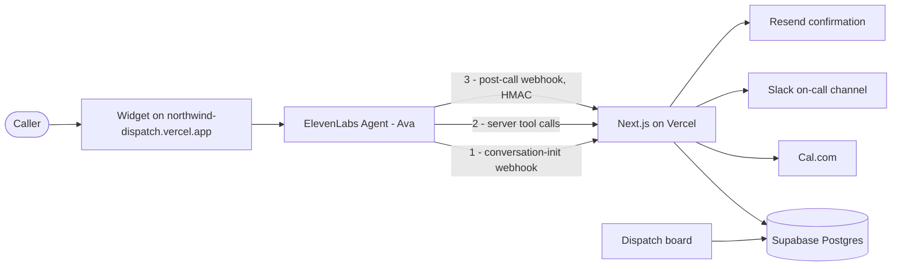

# Northwind Dispatch Agent

An after-hours voice dispatcher for a fictional HVAC and plumbing contractor, built on
the ElevenLabs Agents platform.

**Northwind Heating & Air** runs twelve trucks across the Twin Cities. Roughly 40% of
their inbound calls arrive after hours, hit voicemail, and a large share of those callers
dial a competitor instead. "Ava" answers those calls: she triages urgency, identifies the
caller, books a technician against a real calendar, pages on-call, and hands off to a
human when she is out of her depth.

- **Live:** https://northwind-dispatch.vercel.app — customer surface
- **Board:** https://northwind-dispatch.vercel.app/dispatch — what dispatch sees
- **Design:** [`docs/superpowers/specs/`](docs/superpowers/specs/) — the spec this was built from
- **Resources:** [`docs/provisioned-resources.md`](docs/provisioned-resources.md) — every id, and the traps
- **Recording:** [`docs/recording-runbook.md`](docs/recording-runbook.md) — how the demo gets shot

---

## Architecture



One Next.js app serves three things: the customer page with the widget, the `/dispatch`
board, and the API routes. Nothing else is deployed.

| Endpoint | Role |
| --- | --- |
| `POST /api/conversation-init` | Caller lookup. Returns dynamic variables and the finished greeting. Shared-secret header. |
| `POST /api/tools/get-availability` | Cal.com slots, filtered by urgency, returned as a speakable string. |
| `POST /api/tools/book-job` | Cal.com booking + job row awaited; Slack and email deferred. Idempotent. |
| `POST /api/webhooks/post-call` | HMAC-verified. Persists summary, collection fields and eval results. Drives the board. |

---

## The three decisions worth defending

**The customer lookup is not a tool.** It happens in the conversation-initiation webhook,
before the agent's first word. Ava opens with *"Hi Daryl — is this about the unit at 1400
Maple?"* with zero added latency. The same lookup as a mid-call tool produces "let me pull
that up" followed by dead air.

**`book_job` fans out server-side, but awaits only one thing.** Cal.com, Slack and the
confirmation email all live behind one idempotent endpoint rather than three tools the
model has to remember to call. Only the booking is awaited, because only it is needed to
speak the confirmation; Slack and email go out via `waitUntil` after the response returns.
Fanning out is not automatically faster — done naively it puts three vendors in series
inside the call the caller is waiting on.

**The hazard path is structural, not instructed.** Gas smell, carbon monoxide or a
sounding alarm routes to a workflow node with a fixed script, evaluated both at the start
of the call and mid-conversation. That node has **no outgoing edges** — it is a sink, so
there is no route from the hazard path back into booking. A prompt instruction would be a
preference; a graph with no edge out is a guarantee.

---

## Repository

```
agent/
  system-prompt.md           drafting source for the prompt
  analysis.md                data collection fields + the four eval criteria
  workflow.json              the safety branch, as deployed
  build-workflow.py          regenerates it
  build-tools.py             registers the two webhook tools
  test-gas-leak.json         the simulation test, version controlled
agent_configs/               `elevenlabs agents pull` output — the tracked agent config
knowledge-base/              three RAG documents + a README on what is deliberately absent
supabase/                    migration and seed
src/app/                     pages and API routes
src/lib/                     caller resolution, Cal.com, notify, speech, auth
docs/provisioned-resources.md  ids, versions, and the traps that cost time
```

Prompt and workflow are diffable. `git diff agent_configs/` on a prompt change is the
point of keeping them here.

---

## Setup

```bash
npm install
cp .env.example .env.local     # fill in
npm run dev
```

Apply `supabase/migrations/0001_init.sql`, then `supabase/seed.sql` with your own number
in **E.164, no spaces** — `+6591234567`, never `+65 91234567`. The lookup is an exact
string match against the caller id, so one space is the difference between the
personalized greeting and the generic one, and it fails silently.

Register the tools and workflow:

```bash
python agent/build-tools.py
python agent/build-workflow.py
```

Three settings must all be true or the personalized open silently degrades to the generic
greeting, with no error anywhere:

| Setting | Where |
| --- | --- |
| `conversation_initiation_client_data_webhook.url` | workspace settings |
| `enable_conversation_initiation_client_data_from_webhook` | agent → Security |
| `overrides.conversation_config_override.agent.first_message` | agent → Security |

---

## Testing

```bash
curl -X POST .../v1/convai/agents/{agent_id}/run-tests \
  -d '{"tests":[{"test_id":"..."}]}'
```

One simulation test pins the gas-leak path: the simulated caller opens with a furnace
fault and mentions gas two turns later, then pushes twice for an appointment. It asserts
the evacuation script fires and that nothing is booked, priced, or diagnosed afterwards.

Only `book_job` is mocked, with `raise_error`, so a stray booking attempt fails loudly.
Mocking *all* tools was the first attempt and it proved nothing — `get_availability`
errored on turn one, Ava correctly transferred, and the call ended before gas was ever
mentioned.

That test earned its place. It found two bugs invisible in the graph: hazards raised
mid-call were not routed at all, and the safety node never got to speak because its
outgoing edge fired on entry.

---

## Cuts

Stated plainly, because scope judgment is the point:

- **No phone number.** This is the significant one. The design is built around inbound
  PSTN and the conversation-initiation webhook firing on caller id. Twilio does not
  provision numbers on trial accounts, and the account was not upgraded, so the widget is
  the demo surface instead. The page calls the *same* `resolveCaller` the webhook route
  calls and passes the result to the widget as dynamic variables — same lookup, same
  greeting, different transport. What it does not exercise is the webhook round-trip
  itself, because a web session has no caller id to send.
- **No authentication on the dispatch board.** RLS is on with no policies, so the anon key
  reads nothing and the board goes through a server route — the cut is one public page,
  not a public database.
- **No job-status lookup.** Scoped, then cut: an endpoint, a tool and a workflow branch
  for a path the demo never shows.
- **No SMS.** The Twilio trial prefix would land inside the money shot, so confirmations
  go by email. One channel either way.
- **Single technician calendar** rather than round-robin routing. **No payments.** **No
  batch outbound reminders.** **No multi-agent transfer** — `transfer_to_number` to a
  human is the right primitive at this size.

## Next

Upgrade Twilio and the phone path is a config change, not a rewrite — the webhook, the
resolution logic and the dynamic variables are already in place and tested. After that:
round-robin routing across the twelve trucks, batch outbound for appointment reminders,
and auth on the board.
