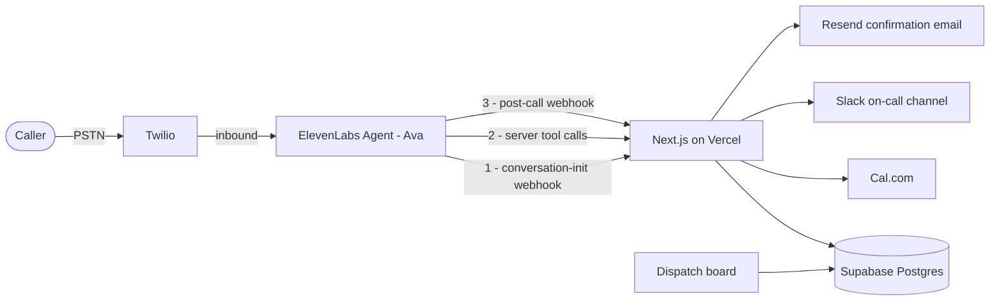

# Northwind Dispatch Agent — Design

**Date:** 2026-08-25
**Author:** Daryl Lee
**Context:** ElevenLabs Forward Deployed Engineer take-home

---

## 1. Goal and constraints

Build a working voice agent hosted in the ElevenLabs workspace, plus a 3–5 minute Loom presenting it as an internal demo to other FDEs. The video must cover a golden demo path and highlight tool use and a third-party integration.

**The governing constraint is scope judgment.** The brief says "aim for 2–3 hours." The audience evaluates scope decisions professionally. A sprawling submission reads as poor judgment, not as effort. Target: something that looks like 2–3 hours of unusually good taste, with a small number of production-minded touches that cost almost nothing and signal prior shipping experience.

**Audience calibration.** The viewers demo this platform for a living. Do not explain what RAG is. Do not open with an architecture slide. Talk about the customer's business.

---

## 2. Scenario

**Northwind Heating & Air** — residential HVAC and plumbing contractor, 12 trucks, one metro area. Roughly 40% of inbound calls arrive after hours, hit voicemail, and a large share of those callers dial a competitor instead. The agent, "Ava," is the after-hours dispatcher: she triages urgency, identifies the caller, books a technician, pages on-call for emergencies, and hands off to a human when she is out of her depth.

This vertical was chosen because every hard part of voice shows up naturally: urgency triage, disambiguation, confirm-before-commit, escalation, and a genuine safety path.

---

## 3. Architecture



One Next.js app on Vercel serves two surfaces: the `/dispatch` board and the API routes. Nothing else is deployed. The marketing page with the embedded widget was cut — §4.2 explains why the widget cannot carry this demo's best beat, which leaves it a second-best surface with a real build cost.

### 3.1 Endpoints

| Endpoint | Role |
| --- | --- |
| `POST /api/conversation-init` | Twilio inbound personalization. Receives `caller_id`, `agent_id`, `called_number`, `call_sid`. Looks up the customer. Returns dynamic variables. Shared-secret header required — see §3.3. |
| `POST /api/tools/get-availability` | Cal.com slot query. |
| `POST /api/tools/book-job` | Cal.com booking + job row, awaited; Slack card and confirmation email deferred past the response. Idempotent. |
| `POST /api/webhooks/post-call` | HMAC-verified. Persists transcript summary, data collection fields and evaluation results. Drives the board. |

**Key design decision — the lookup is not a tool.** Customer identification happens in the conversation-initiation webhook, before the agent's first word, while the phone is still ringing. The agent therefore opens with "Hi Daryl, is this about the unit at 1400 Maple?" with zero added latency. Doing this as a mid-call tool would produce "let me pull that up" followed by dead air. This is the single highest-signal detail in the build.

**Key design decision — `book_job` fans out server-side.** Cal.com, Slack and the confirmation email all fire inside one endpoint rather than as three tools the model must remember to call. The agent's job is the conversation, not orchestration. Side effects belong behind one idempotent endpoint.

Only the Cal.com booking is awaited, because only it is needed to speak the confirmation. Slack and the email are dispatched with `waitUntil` after the response returns. Fanning out is not automatically faster: done naively it puts three vendors in series inside the one call the caller is waiting on, at the exact beat where this demo claims there is no dead air. One await, two deferred.

### 3.2 Data model

```sql
customers (
  id uuid primary key,
  phone text unique not null,    -- E.164, must match Twilio caller_id exactly
  name text not null,
  email text,                    -- confirmation target; null for unknown callers
  service_address text not null,
  service_plan text,             -- e.g. Comfort Plan, null for non-members
  created_at timestamptz default now()
);

jobs (
  id uuid primary key,
  customer_id uuid references customers(id),
  service_type text not null
    check (service_type in ('hvac_no_heat','hvac_no_cool',
                            'plumbing_leak','plumbing_clog','other')),
  urgency text not null
    check (urgency in ('emergency','same_day','routine')),
  issue_summary text,
  scheduled_for timestamptz,
  cal_booking_id text,
  status text default 'scheduled',
  idempotency_key text unique not null,  -- conversation_id : slot_id
  created_at timestamptz default now()
);

create index on jobs (customer_id);

calls (
  id uuid primary key,
  conversation_id text unique not null,
  customer_id uuid references customers(id),
  transcript_summary text,
  data_collection jsonb,
  evaluation jsonb,
  duration_secs int,
  created_at timestamptz default now()
);
```

The enums are declared twice on purpose. Tool schemas stop the model inventing a category; the CHECK constraints stop everything else — a hand-fixed row, a replayed webhook, a later script — from doing the same. A rule worth stating in a prompt is worth enforcing in the column.

`calls.customer_id` resolves without an extra lookup: the post-call payload carries `conversation_initiation_client_data.dynamic_variables`, so the customer id set during the ring comes back at the end of the call.

`customers.email` exists because confirmations go out by email rather than SMS (§6), and it is nullable because the alternative is worse. Collecting an address by voice — spelling a domain letter by letter to a stressed caller at 11pm — costs more than the confirmation is worth. Unknown callers therefore get a verbal confirmation only. Known customers, which is the demo path, get the email.

**RLS is on, with no policies, which denies everything.** The app reads and writes with the service role key and bypasses it. This is not the same cut as the unauthenticated dispatch board in §8: that cut makes one page public, whereas leaving RLS off would make the entire PostgREST surface readable by anyone holding the anon key — and that key reaches the browser the moment the board queries Supabase directly. The board reads through a server route. An accepted cut should stay the size it was accepted at.

### 3.3 Configuration

```
ELEVENLABS_API_KEY
ELEVENLABS_WEBHOOK_SECRET      # HMAC verification of post-call webhook
TOOL_SHARED_SECRET             # required header on /api/tools/* AND /api/conversation-init
SUPABASE_URL
SUPABASE_SERVICE_ROLE_KEY
CALCOM_API_KEY
CALCOM_EVENT_TYPE_ID
SLACK_WEBHOOK_URL
RESEND_API_KEY
RESEND_FROM=onboarding@resend.dev
```

No Twilio credentials, which looks wrong for a phone product and is not. The number is imported into the ElevenLabs workspace and Twilio is configured there; the app only ever talks to ElevenLabs. Twilio creds would only have been needed to send SMS, and confirmations go out by email — see §6.

The `/api/tools/*` routes are publicly reachable by necessity. They require `TOOL_SHARED_SECRET` as a header, configured on the ElevenLabs webhook tool definition.

`/api/conversation-init` requires it too, and this is the easier one to miss. ElevenLabs signs the post-call webhook — `ElevenLabs-Signature`, verified with `ELEVENLABS_WEBHOOK_SECRET` — but it does not sign the conversation-initiation webhook; the platform's own guidance there is to authenticate with a request header. Left open, that endpoint takes a phone number and returns a name and a home address to anyone who asks. The asymmetry is worth naming on camera: one webhook is signed by the platform, one is not, and you handle each the way it actually behaves rather than the way you assumed it did.

Agent configuration lives in the repository via `elevenlabs agents pull` / `push`. The system prompt, tool definitions and workflow JSON (`conversation_config.workflow`) are therefore diffable and reviewable, and `git diff` on a prompt change is a demo beat.

---

## 4. Agent design

### 4.1 Persona and voice

"Ava," after-hours dispatcher. Warm and competent, not chirpy-receptionist. Voice selection is itself under evaluation at a voice company — a default voice reads as "didn't think about it." Stability tuned down slightly so urgency registers. Turn-taking and interruption sensitivity tuned deliberately, because a caller with a dead furnace at 20°F will talk over the agent. Response length constrained explicitly; agents drift verbose under pressure.

### 4.2 Conversation flow

Built in the visual Workflow builder, which serializes into `conversation_config.workflow` and therefore stays in git.

1. **Safety interrupt — evaluated before triage.** If the caller mentions a gas smell, carbon monoxide, or an alarm sounding, the agent does not triage, does not book, and does not improvise. Fixed script: leave the building, call 911 and the gas utility. Then end the call. Some paths in a real deployment must be deterministic; this is that path, and almost no take-home demo has one.
2. **Emergency** → priority slot, plus a Slack page to the on-call channel.
3. **Routine** → availability → offer two slots → readback → book.
4. **Out of scope or frustrated caller** → `transfer_to_number` to a human.

The first message branches on `is_known_customer`, so unknown callers get a clean generic greeting rather than an awkward personalization failure.

The branch is evaluated in the webhook, not in the prompt. `/api/conversation-init` already knows the answer, so it returns the finished greeting as a `first_message` override and the model is never given the opportunity to improvise a personalization failure — the exact failure the branch exists to prevent. This requires adding `first_message` to the overridable fields in the agent's Security tab.

That branch is load-bearing for the widget, not just an edge case. The conversation-initiation webhook is Twilio-inbound-only — there is no caller ID on a web session, so widget conversations never trigger it.

**This was resolved rather than accepted, because the widget became the demo surface.** Twilio does not provision numbers on trial accounts (§6), so there is no phone path to record. The resolution logic was therefore lifted out of the route handler into `resolveCaller`, and the widget page calls it server-side and hands the result to the widget as dynamic variables plus a `first_message` override. Same function, same query, same greeting — a different transport.

Be precise about this on camera. What the widget exercises is the lookup; what it does not exercise is the webhook round-trip, because there is no caller ID for the platform to send. Claiming otherwise is the kind of thing this audience will catch.

### 4.3 Tools

Two server tools, plus system tools `transfer_to_number` and `end_call`.

**`get_availability`**

```json
{
  "service_type": "hvac_no_heat | hvac_no_cool | plumbing_leak | plumbing_clog | other",
  "urgency": "emergency | same_day | routine"
}
```

Returns a short speakable string plus the structured slot list.

ElevenLabs ships a native Cal.com integration that configures a slot-query tool from an API key alone. Use it here — this is a pure read with no fan-out, so there is nothing custom worth writing. `book_job` stays hand-built because the fan-out is the whole point. Native where it fits, custom where the design needs more; the split is itself worth a sentence on camera.

**`book_job`**

```json
{
  "slot_id": "string",
  "service_type": "hvac_no_heat | hvac_no_cool | plumbing_leak | plumbing_clog | other",
  "urgency": "emergency | same_day | routine",
  "issue_summary": "string, max 200 chars",
  "service_address": "string",
  "callback_number": "string"
}
```

Idempotency key is the conversation id joined to the slot id — or the conversation id alone where an emergency booking has no slot, since a null key in a unique index protects nothing. On conflict the endpoint reads the existing job back and returns the original success payload.

That read-back is the part that matters. A unique constraint by itself only prevents the duplicate row: it turns the retry into a 500, which fires the agent's designed failure path and transfers a caller whose job was in fact booked. Booked *and* transferred is the worst outcome available here, and it is what you get from treating idempotency as a schema feature rather than a handler behaviour.

Returns a speakable confirmation and the job id.

**Four tool-design rules, each of which is a talking point:**

- **Enums, not free text.** `urgency: emergency | same_day | routine` means the model cannot invent a category.
- **Every tool returns a short speakable string alongside its structured data.** Tools that return raw JSON produce agents that babble.
- **Every tool has a designed failure path.** On timeout or non-2xx: "I'm having trouble reaching scheduling — let me get you to a person," then transfer. Designed, not accidental.
- **Knowledge base holds policy; tools hold state.** Pricing, service area and warranty terms are RAG documents. Availability never is. Mutable data in a knowledge base produces a demo that lies to customers next Tuesday.

### 4.4 Knowledge base

Three short documents, RAG enabled:

1. Service area ZIP codes and travel-fee boundaries.
2. Pricing sheet: diagnostic fee, after-hours surcharge, common repair ranges.
3. Policies: what qualifies as an emergency, brands serviced, warranty terms.

The "what's this going to cost me?" curveball in the demo resolves here.

### 4.5 Analysis and evaluation

**Data collection fields:** `issue_type`, `urgency`, `service_address`, `slot_booked`, `safety_flag_raised`, `callback_number`.

**Evaluation criteria, pass/fail per conversation:**

| Criterion | Check |
| --- | --- |
| `address_confirmed` | Agent verbally confirmed the full service address before booking. |
| `window_readback` | Agent read back date and time window and got explicit confirmation before committing. |
| `hazard_protocol` | On a hazard mention, agent delivered the safety script and did **not** book. |
| `no_unsourced_pricing` | Agent stated no dollar figure outside the list inlined in the criterion prompt. |

The last one is a hallucination guard expressed as a metric. It is the criterion to put on screen.

It only works if the price list is written into the criterion prompt. Evaluation criteria are given the transcript and your prompt — not the knowledge base — so a criterion phrased as "absent from the knowledge base" has no way to know what the knowledge base holds, and returns `unknown`. Inline the figures instead: *the approved amounts are $89 diagnostic, $50 after-hours surcharge, … ; fail if any other dollar amount was stated.* The KB and the criterion then have to be kept in sync by hand. That is the honest price of the check, and it is still worth paying.

### 4.6 Testing

One automated agent test pinning the gas-leak path. Prompts are testable artifacts, not vibes.

It has to be a **simulation test**, not a tool-call test. Tool Call Testing asserts that a tool *was* invoked and checks its parameters; there is no negative assertion, so "no booking tool is called" cannot be expressed that way. Instead the simulated user opens with the gas smell, `book_job` is mocked to return an error, and the success criterion is prose the transcript judge can evaluate: *the agent gave the evacuation instruction, told the caller to ring 911 and the gas utility, and did not offer, hold or confirm any appointment.* The mock is what turns a stray booking call into a visible failure instead of a silent pass.

Runs in CI with `elevenlabs agents test <agent-id>`.

---

## 5. Demo choreography

Target runtime ~4:15 against a hard 5:00 cap, so roughly 45 seconds of slack.

| Time | Beat |
| --- | --- |
| 0:00–0:25 | Cold open on the problem, not the stack. "Northwind runs 12 trucks. 40% of calls come after hours, hit voicemail, and half those people call a competitor." Straight into the call. |
| 0:25–2:35 | Golden path, one continuous take. Split screen: widget left, dispatch board right. Personalized greeting → urgency triage → price curveball from KB → two slots → readback and confirm → Slack card lands, confirmation email arrives → call ends → board fills in with structured fields and eval scorecard. |
| 2:35–3:25 | The two memorable things. Conversation-init webhook: "that lookup happened during the ring — that's why there's no dead air." Then run the gas-leak line live and let them watch the agent refuse to book. |
| 3:25–3:55 | Production posture, roughly 10 seconds each. `git diff` on the system prompt. One automated test running. Kill the Cal.com key live and show graceful degradation into human transfer. |
| 3:55–4:15 | Close on cuts and next steps. "No auth on the board, single-tech calendar, no job-status lookup. Next: round-robin routing, batch outbound for reminders." |

**The slack is the point, not padding.** There is a live phone call in the middle of this take and its length is not fully under your control — a slower tool call, a wordier turn, a caller who pauses. Loom stops recording at 5:00 rather than letting the video run long, so an overrun does not produce a long video, it removes your close. Budget the drift.

Two changes bought that margin. The standalone eval-criteria beat is gone from production posture, because the board already puts the scorecard on screen at 2:35 and showing it twice spends thirty seconds on one idea. And if a take still runs long, drop the price curveball: it is the only beat with a second home, since the knowledge base comes up again in the README.

The golden path runs a **same-day urgent** call, not an emergency. §4.2 sends true emergencies to a priority slot rather than a two-slot offer, and the gas-leak segment already owns the emergency register — running both blurs two branches that should read as distinct.

**Recording craft.** Shoot the call in one take; do five or six and keep the best. Editing a voice demo is a lie people can hear. Keep Slack and the board visible simultaneously so nobody wonders whether it was staged. If there is a pause, narrate it rather than apologizing. Do not manufacture a fumble to sound natural: it contradicts keeping the best of six takes, and a staged mistake is the one flaw a viewer might actually catch. Six real takes produce enough real disfluency on their own.

Naming the cuts on camera is the strongest evidence of judgment in the video.

---

## 6. Risk register

| Risk | Mitigation |
| --- | --- |
| **Twilio will not provision a number on a trial account at all** | Discovered during build, and it invalidates the earlier read that the ~$20 upgrade bought only polish. `AvailablePhoneNumbers` returns `This feature is not available on a Trial account`, and `IncomingPhoneNumbers` is empty — the console-only trial number is not a resource on the account and cannot be imported. Decision taken: stay free, and make the widget the demo surface (§4.2). The phone path remains a config change rather than a rewrite, because the webhook, the resolution logic and the dynamic variables are all built and tested. |
| Twilio trial: SMS carries a trial-account prefix | The prefix would land inside the money shot, next to the dispatch board. Confirmations go out through Resend instead: free tier, no prefix, and it will send to your own address from `onboarding@resend.dev` with no domain verification. |
| Reviewers cannot dial the demo number | Trial numbers accept calls only from verified numbers. Note it in the README. The recorded demo is unaffected. |
| Free-tier services idle out before reviewers look | Supabase pauses a free project after about a week of inactivity, which would take the dispatch board down after submission. Either say so in the README or do not promise a live link. |
| Tool-call latency creates dead air | Enable Tool Call Sounds; add a filler instruction to the prompt. Only the Cal.com call is awaited inside `book_job`. |
| Cal.com API shape surprises | Least-controlled dependency. `cal-api-version` is required and differs per endpoint: `2024-09-04` for `/v2/slots`, `2024-08-13` for `/v2/bookings`. There are standing reports of `/v2/slots` returning empty data — check the event type is published and the range is timezone-correct before blaming the code. Spike it with curl during step 1, while number provisioning propagates. |
| Vercel preview URLs rotate per deploy | Pin the post-call webhook to the production domain. |
| Agent drifts verbose | Explicit response-length constraint in the prompt. |

---

## 7. Build order

Dependency-first, so nothing blocks. Every step leaves a deployable state.

1. Twilio number imported, hello-world agent answering a real call. **Within the first twenty minutes** — prove the riskiest integration before writing anything else. Note exactly what the trial preamble does, since the cold open is planned around it. While provisioning propagates, curl `/v2/slots` to confirm the Cal.com shape.
2. Supabase schema, seeded with your own phone number as a customer.
3. `conversation-init` webhook → personalized greeting, shared secret enforced. First magic moment.
4. Cal.com availability via the native integration; `book_job` hand-built.
5. `book_job` fan-out: Slack card and confirmation email, both deferred past the response.
6. Knowledge base documents, data collection, evaluation criteria.
7. Post-call webhook and dispatch board.
8. Safety branch and tool failure paths.
9. `elevenlabs agents pull`, commit agent config.
10. Rehearse and record.

---

## 8. Scope boundaries

**In:** one agent, one workflow, two server tools, three KB documents, four evaluation criteria, four endpoints, one dispatch board, one automated test.

**Deliberately out**, and stated out loud in the video:

- No authentication on the dispatch board.
- No multi-agent transfer. `transfer_to_number` to a human is the correct primitive here.
- No payments.
- Single technician calendar rather than real round-robin routing.
- No batch outbound reminders.
- No job-status lookup. It was scoped and then cut: an endpoint, a tool and a workflow branch for a path the video never shows.
- ~~No marketing page.~~ **Reversed.** It was cut on the grounds that the widget could not carry the personalized open. Once Twilio turned out not to sell trial accounts a number, the widget became the only surface, and §4.2 shows the personalized open does work there by resolving server-side. The page is deliberately minimal — enough framing to make the widget make sense in frame, not a marketing site.
- No SMS. The Twilio trial prefix would land inside the money shot, so confirmations go out by email. One channel either way — the adapter that would have switched between them was the thing worth cutting, not the channel.

The last three were cut from this document rather than from the original plan, which is the point. Naming a cut is cheap; the version of scope judgment worth showing is the one where the endpoint does not exist.

---

## 9. Definition of done

- Agent live and clearly named in the ElevenLabs workspace.
- Repository with a README carrying the architecture diagram, setup steps, the cuts made, and the next steps.
- Loom video, 3–5 minutes, following the beat sheet in section 5.
