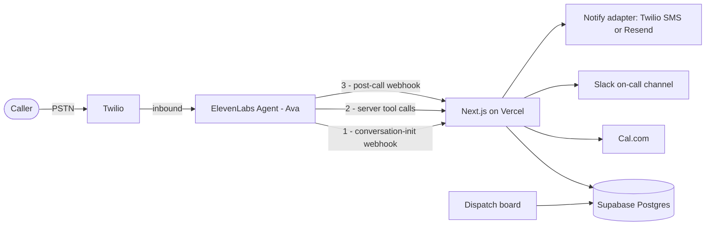

# Northwind Dispatch Agent — Design

**Date:** 2026-08-25
**Author:** Daryl Lee
**Context:** ElevenLabs Forward Deployed Engineer take-home

---

## 1. Goal and constraints

Build a working voice agent hosted in the ElevenLabs workspace, plus a 3–5 minute Loom presenting it as an internal demo to other FDEs. The video must cover a golden demo path and highlight tool use and a third-party integration.

**The governing constraint is scope judgment.** The brief says "aim for 2–3 hours." The audience evaluates scope decisions professionally. A sprawling submission reads as poor judgment, not as effort. Target: something that looks like 2–3 hours of unusually good taste, with a small number of production-minded touches that cost almost nothing and signal prior shipping experience.

**Audience calibration.** The viewers demo this platform for a living. Do not explain what RAG is. Do not open with an architecture slide. Talk about the customer's business.

---

## 2. Scenario

**Northwind Heating & Air** — residential HVAC and plumbing contractor, 12 trucks, one metro area. Roughly 40% of inbound calls arrive after hours, hit voicemail, and a large share of those callers dial a competitor instead. The agent, "Ava," is the after-hours dispatcher: she triages urgency, identifies the caller, books a technician, pages on-call for emergencies, and hands off to a human when she is out of her depth.

This vertical was chosen because every hard part of voice shows up naturally: urgency triage, disambiguation, confirm-before-commit, escalation, and a genuine safety path.

---

## 3. Architecture



One Next.js app on Vercel serves three surfaces: the Northwind marketing page with the widget embedded, the `/dispatch` board, and the API routes. Nothing else is deployed.

### 3.1 Endpoints

| Endpoint | Role |
| --- | --- |
| `POST /api/conversation-init` | Twilio inbound personalization. Receives `caller_id`, `agent_id`, `called_number`, `call_sid`. Looks up the customer. Returns dynamic variables. |
| `POST /api/tools/get-availability` | Cal.com slot query. |
| `POST /api/tools/book-job` | Cal.com booking + job row + Slack card + confirmation notice, in one idempotent call. |
| `POST /api/tools/lookup-job-status` | Status and ETA for the caller's open job. |
| `POST /api/webhooks/post-call` | HMAC-verified. Persists transcript summary, data collection fields and evaluation results. Drives the board. |

**Key design decision — the lookup is not a tool.** Customer identification happens in the conversation-initiation webhook, before the agent's first word, while the phone is still ringing. The agent therefore opens with "Hi Daryl, is this about the unit at 1400 Maple?" with zero added latency. Doing this as a mid-call tool would produce "let me pull that up" followed by dead air. This is the single highest-signal detail in the build.

**Key design decision — `book_job` fans out server-side.** Cal.com, Slack and the confirmation notice all fire inside one endpoint rather than as three tools the model must remember to call. The agent's job is the conversation, not orchestration. Side effects belong behind one idempotent endpoint. This also halves tool-call latency in the most important beat of the demo.

### 3.2 Data model

```sql
customers (
  id uuid primary key,
  phone text unique not null,
  name text not null,
  service_address text not null,
  service_plan text,             -- e.g. Comfort Plan, null for non-members
  created_at timestamptz default now()
);

jobs (
  id uuid primary key,
  customer_id uuid references customers(id),
  service_type text not null,    -- enum, see tool schemas
  urgency text not null,         -- emergency | same_day | routine
  issue_summary text,
  scheduled_for timestamptz,
  cal_booking_id text,
  status text default 'scheduled',
  idempotency_key text unique,   -- conversation_id : slot_id
  created_at timestamptz default now()
);

calls (
  id uuid primary key,
  conversation_id text unique not null,
  customer_id uuid references customers(id),
  transcript_summary text,
  data_collection jsonb,
  evaluation jsonb,
  duration_secs int,
  created_at timestamptz default now()
);
```

### 3.3 Configuration

```
ELEVENLABS_API_KEY
ELEVENLABS_WEBHOOK_SECRET      # HMAC verification of post-call webhook
TOOL_SHARED_SECRET             # required header on /api/tools/* — these routes are public
SUPABASE_URL
SUPABASE_SERVICE_ROLE_KEY
CALCOM_API_KEY
CALCOM_EVENT_TYPE_ID
SLACK_WEBHOOK_URL
TWILIO_ACCOUNT_SID
TWILIO_AUTH_TOKEN
TWILIO_FROM_NUMBER
RESEND_API_KEY
NOTIFY_CHANNEL=sms|email       # adapter switch, decided after reviewing demo footage
```

The `/api/tools/*` routes are publicly reachable by necessity. They require `TOOL_SHARED_SECRET` as a header, configured on the ElevenLabs webhook tool definition.

Agent configuration lives in the repository via `elevenlabs agents pull` / `push`. The system prompt, tool definitions and workflow JSON (`conversation_config.workflow`) are therefore diffable and reviewable, and `git diff` on a prompt change is a demo beat.

---

## 4. Agent design

### 4.1 Persona and voice

"Ava," after-hours dispatcher. Warm and competent, not chirpy-receptionist. Voice selection is itself under evaluation at a voice company — a default voice reads as "didn't think about it." Stability tuned down slightly so urgency registers. Turn-taking and interruption sensitivity tuned deliberately, because a caller with a dead furnace at 20°F will talk over the agent. Response length constrained explicitly; agents drift verbose under pressure.

### 4.2 Conversation flow

Built in the visual Workflow builder, which serializes into `conversation_config.workflow` and therefore stays in git.

1. **Safety interrupt — evaluated before triage.** If the caller mentions a gas smell, carbon monoxide, or an alarm sounding, the agent does not triage, does not book, and does not improvise. Fixed script: leave the building, call 911 and the gas utility. Then end the call. Some paths in a real deployment must be deterministic; this is that path, and almost no take-home demo has one.
2. **Emergency** → priority slot, plus a Slack page to the on-call channel.
3. **Routine** → availability → offer two slots → readback → book.
4. **Existing job** → status lookup and ETA.
5. **Out of scope or frustrated caller** → `transfer_to_number` to a human.

The first message branches on `is_known_customer`, so unknown callers get a clean generic greeting rather than an awkward personalization failure.

That branch is load-bearing for the widget, not just an edge case. The conversation-initiation webhook is Twilio-inbound-only — there is no caller ID on a web session, so widget conversations always arrive with `is_known_customer = false` and take the generic greeting. The widget is therefore a legitimate fallback demo surface, but it cannot show the personalized-open beat. Plan the recording accordingly.

### 4.3 Tools

Three server tools, plus system tools `transfer_to_number` and `end_call`.

**`get_availability`**

```json
{
  "service_type": "hvac_no_heat | hvac_no_cool | plumbing_leak | plumbing_clog | other",
  "urgency": "emergency | same_day | routine"
}
```

Returns a short speakable string plus the structured slot list.

**`book_job`**

```json
{
  "slot_id": "string",
  "service_type": "hvac_no_heat | hvac_no_cool | plumbing_leak | plumbing_clog | other",
  "urgency": "emergency | same_day | routine",
  "issue_summary": "string, max 200 chars",
  "service_address": "string",
  "callback_number": "string"
}
```

Idempotency key is the conversation id joined to the slot id, so a retry cannot double-book. Returns a speakable confirmation, the job id, and which channel the confirmation went out on.

**`lookup_job_status`** — no caller-supplied parameters; resolved against the `customer_id` dynamic variable set at conversation init.

**Four tool-design rules, each of which is a talking point:**

- **Enums, not free text.** `urgency: emergency | same_day | routine` means the model cannot invent a category.
- **Every tool returns a short speakable string alongside its structured data.** Tools that return raw JSON produce agents that babble.
- **Every tool has a designed failure path.** On timeout or non-2xx: "I'm having trouble reaching scheduling — let me get you to a person," then transfer. Designed, not accidental.
- **Knowledge base holds policy; tools hold state.** Pricing, service area and warranty terms are RAG documents. Availability never is. Mutable data in a knowledge base produces a demo that lies to customers next Tuesday.

### 4.4 Knowledge base

Three short documents, RAG enabled:

1. Service area ZIP codes and travel-fee boundaries.
2. Pricing sheet: diagnostic fee, after-hours surcharge, common repair ranges.
3. Policies: what qualifies as an emergency, brands serviced, warranty terms.

The "what's this going to cost me?" curveball in the demo resolves here.

### 4.5 Analysis and evaluation

**Data collection fields:** `issue_type`, `urgency`, `service_address`, `slot_booked`, `safety_flag_raised`, `callback_number`.

**Evaluation criteria, pass/fail per conversation:**

| Criterion | Check |
| --- | --- |
| `address_confirmed` | Agent verbally confirmed the full service address before booking. |
| `window_readback` | Agent read back date and time window and got explicit confirmation before committing. |
| `hazard_protocol` | On a hazard mention, agent delivered the safety script and did **not** book. |
| `no_unsourced_pricing` | Agent stated no dollar figure absent from the knowledge base. |

The last one is a hallucination guard expressed as a metric. It is the criterion to put on screen.

### 4.6 Testing

One automated agent test pinning the gas-leak path, asserting the safety script fires and no booking tool is called. Prompts are testable artifacts, not vibes.

---

## 5. Demo choreography

Target runtime ~4:00.

| Time | Beat |
| --- | --- |
| 0:00–0:25 | Cold open on the problem, not the stack. "Northwind runs 12 trucks. 40% of calls come after hours, hit voicemail, and half those people call a competitor." Straight into the call. |
| 0:25–2:15 | Golden path, one continuous take. Split screen: phone left, dispatch board right. Personalized greeting → emergency triage → price curveball from KB → two slots → readback and confirm → Slack card lands, confirmation arrives → call ends → board fills in with structured fields and eval scorecard. |
| 2:15–3:10 | The two memorable things. Conversation-init webhook: "that lookup happened during the ring — that's why there's no dead air." Then run the gas-leak line live and let them watch the agent refuse to book. |
| 3:10–3:50 | Production posture, roughly 10 seconds each. `git diff` on the system prompt. Eval criteria pass/fail on the conversation record. One automated test running. Kill the Cal.com key live and show graceful degradation into human transfer. |
| 3:50–4:15 | Close on cuts and next steps. "No auth on the board, single-tech calendar. Next: round-robin routing, batch outbound for reminders." |

**Recording craft.** Shoot the call in one take; do five or six and keep the best. Editing a voice demo is a lie people can hear. Keep Slack and the board visible simultaneously so nobody wonders whether it was staged. If there is a pause, narrate it rather than apologizing. Deliberately fumble one line — a caller who reads their script perfectly sounds like a caller reading a script.

Naming the cuts on camera is the strongest evidence of judgment in the video.

---

## 6. Risk register

| Risk | Mitigation |
| --- | --- |
| Tool-call latency creates dead air | Enable Tool Call Sounds; add a filler instruction to the prompt. |
| Cal.com API shape surprises | Least-controlled dependency. Build against it first. |
| Twilio trial: inbound only from verified caller IDs | Own phone is auto-verified, so the recorded demo is unaffected. Reviewers cannot dial in. Note in README, or upgrade. |
| Twilio trial: SMS carries a trial-account prefix | Notify adapter allows swapping to Resend email. Decide after reviewing footage. |
| Vercel preview URLs rotate per deploy | Pin the post-call webhook to the production domain. |
| Agent drifts verbose | Explicit response-length constraint in the prompt. |

---

## 7. Build order

Dependency-first, so nothing blocks. Every step leaves a deployable state.

1. Twilio number imported, hello-world agent answering a real call. **Within the first twenty minutes** — prove the riskiest integration before writing anything else.
2. Supabase schema, seeded with your own phone number as a customer.
3. `conversation-init` webhook → personalized greeting. First magic moment.
4. Cal.com availability and booking tools.
5. `book_job` fan-out: Slack card and notify adapter.
6. Knowledge base documents, data collection, evaluation criteria.
7. Post-call webhook and dispatch board.
8. Safety branch and tool failure paths.
9. `elevenlabs agents pull`, commit agent config.
10. Rehearse and record.

---

## 8. Scope boundaries

**In:** one agent, one workflow, three server tools, three KB documents, four evaluation criteria, five endpoints, one dispatch board, one automated test.

**Deliberately out**, and stated out loud in the video:

- No authentication on the dispatch board.
- No multi-agent transfer. `transfer_to_number` to a human is the correct primitive here.
- No payments.
- Single technician calendar rather than real round-robin routing.
- No batch outbound reminders.

---

## 9. Definition of done

- Agent live and clearly named in the ElevenLabs workspace.
- Repository with a README carrying the architecture diagram, setup steps, the cuts made, and the next steps.
- Loom video, 3–5 minutes, following the beat sheet in section 5.
